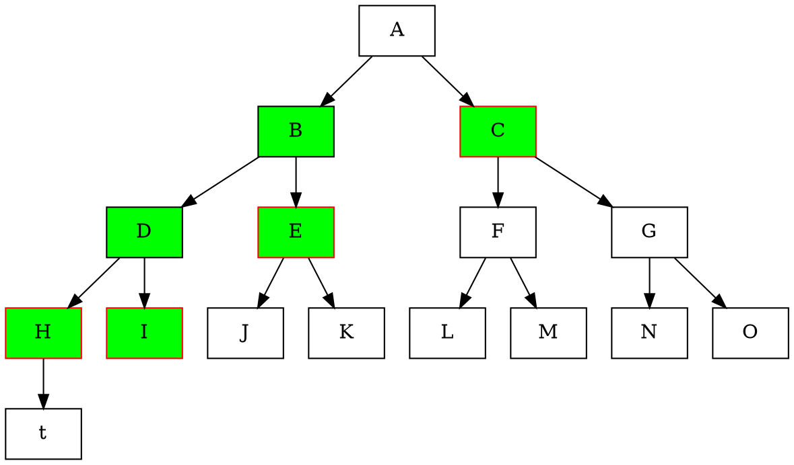

# KES

In Cardano, nodes use Key Evolving Signatures (KES).
This is another asymmetric key cryptographic scheme, also relying on
the use of public and private key pairs.
These signature schemes provide forward cryptographic security, meaning that a
compromised key does not make it easier for an adversary to forge a signature that
allegedly had been signed in the past.

In KES, the public verification key stays constant, but the
corresponding private key evolves incrementally. For this reason, KES
signing keys are indexed by integers representing the step in the key's
evolution. Since the private key evolves incrementally in a KES scheme, the ledger rules
require the pool operators to evolve their keys every time a certain number of
slots have passed. The details of when these keys are evolved are out of the
scope of this document, and the reader is directed to the 
[ledger spec](https://github.com/input-output-hk/cardano-ledger#repository-structure).

## Generalised specification
We use the iterated sum construction from Section 4.3 of MMM[^summedkes].
A KES signature algorithm is parametrized by four algorithms, $\keygen, \sign, \update$ and $\verify$. The sum
construction depends on two signing algorithms, $\Sigma_0 = (\keygen_0, \sign_0, \allowbreak\update_0, \verify_0)$
and $\Sigma_1 = (\keygen_1, \sign_1, \update_1, \verify_1)$, which are forward-secure with $T_0$ and $T_1$ time
periods respectively. As specified in the paper, any digital signature algorithm can be considered as a
forward-secure signature algorithm with 1 time period.
We use two specialized versions of the key generation, one to generate the public
part, and another to generate the secret part, $\pkeygen, \skeygen$ respectively. The KES algorithm
uses a length doubling pseudorandom generator, $\prf:\{0,1\}^{\secparam}\rightarrow\{0,1\}^{\secparam}\times\{0,
1\}^{\secparam}$, where given a random seed, $s$, returns two random seeds of the same size $s_1, s_2$. The sum
construction begins by generating a signing algorithm with two periods by merging two instances of the base signature,
and proceeds recursively until the desired level of periods is reached.

The Chang hard fork will bring optimizations to the KES signature size, and we therefore have
different verification criteria pre and post-Chang. Both instances use
a tree of depth 6. For ease of exposure, we compare both constructions using a simple binary tree
of depth 3 (see figure below). Consider each node as a KES instance with $2^n$ periods, where $n$ is
the height of the node with respect to the leafs. For instance, `A` is a KES instance with $8$ periods,
while node `D` is a KES instance with $2$ periods. Note that each KES instance is created by two child
instances with half the periods.
The only relevant details for compatibility on how KES algorithm works is signature generation and signature
verification, however we provide a description of the other functions. The details on how the keys are managed are
details of implementation which will not be covered here.

In green, we
have the nodes for which we need to store the public key in a signature during pre-babbage eras. With red borders
we have the nodes for which we need to store the public keys in post-babbage eras.

### Pre-Chang
The signing instances of nodes `H`-`O` are single period KES instances, and nodes
`A`-`G` are defined by recursively calling on the algorithms presented above.
In pre-Chang eras the signatures are computed in a naive manner, meaning
that a signature is represented (recursively) as the underlying signature and the two public keys,
$\sigma = (\sigma', \vk_0,\vk_1)$.
So for instance, the signature in node `A` of period 0 contains the signature of node `B`,
$\sigma_b$, the public key of node `B` $\vk_b$ (which is a hash of $\vk_d$ and $\vk_e$) and the public key
of node `C` $\vk_c$ (which is a hash of $\vk_f$ and $\vk_g$). Signature $\sigma_b$ in turn contains
signature of node `D` $\sigma_d$, the public key of node `D` $\vk_d$ (which is a hash of $\vk_h$
and $\vk_i$) and public key of node `E` $\vk_e$ (which is a hash of $\vk_j$ and $\vk_k$). The signature of
node `D`, $\sigma_d$ contains in turn the signature of node `H`, $\sigma_h$, the public key
of node `H`, $\vk_h$ and the public key of node `I` $\vk_i$. Verification of the signature works in
the naive recursive manner. We check that $\hash(\vk_b, \vk_c) = \vk_a$, and $\hash(\vk_d, \vk_e) = \vk_b$, and
$\hash(\vk_h, \vk_i) = \vk_d$, and finally that $\verify(m, \vk_h, \sigma_h) = \accept$.
More specifically:
* $\keygen(\seed)$ takes as input a random seed. It then extends the seed into two parts,
$(\seed_0, \seed_1)\gets\prf(\seed)$, and uses each seed to generate the key material of the next layer. In
particular $(\signingkey_0, \vk_0)\gets\keygen(\seed_0)$ and $\vk_1\gets\pkeygen(\seed_1)$. Finally, it computes
the pair's public key $\vk\gets\hash(\vk_0, \vk_1)$ and returns $(\langle\signingkey_0, \seed_1, \vk_0,
\vk_1\rangle, \vk)$.
\item $\sign(t, \overbrace{\langle\signingkey', \seed_1, \vk_0, \vk_1}^{\signingkey}\rangle, m)$
takes as input a time period $t$, a signing key $\signingkey$ and a message. If $t<T_0$, then it computes the
signature using the first signature algorithm, $\sigma'\gets\sign_0(t, \signingkey', m)$, otherwise it uses the
other $\sigma'\gets\sign_1(t - T_0, \signingkey', m)$. Finally, returns $(\langle\sigma', \vk _0, \vk_1\rangle,
t)$.
* $\update(t, \overbrace{\langle, \signingkey', \seed_1, \vk_0, \vk_1\rangle}^{\signingkey})$ takes as input
a time period $t$, and a signing key $\signingkey$. If $t+1<T_0$, then $\signingkey'\gets\update_0(t,
\signingkey')$. Otherwise, it checks if its changing the key
generation algorithm. Specifically, if $t+1=T_0$, then $\signingkey'\gets\skeygen_1(\seed_1)$ and sets the seed
to zero $\seed_1\gets 0$. Otherwise, $\signingkey'\gets\update_1(t-T_0, \signingkey')$.
* $\verify(\vk, m, \overbrace{\langle\sigma', \vk_0, \vk_1\rangle}^{\sigma},  t)$ takes as input
a verification key, $\vk$, a message, $m$, a signature, $\sigma$, and a time period, $t$. First, it
checks that $\hash(\vk_0, \vk_1) = \vk$. If that is not the case, it returns $\reject$. Otherwise, if $t<T_0$
then $\verify_0(\vk_0, m, \sigma, t)$, else $\verify_1(\vk_1, m, \sigma, t-T_0)$. If verification fails, it
returns $\reject$, otherwise it returns $\accept$.

### Post-Chang
The naive definition of the
signature used in Pre-Chang results in poor performance with respect to the signature size. We
don't need to verify the hash equality at each level, and we simply need to do so at the root. In the Chang
hardfork we introduced such an optimization. In particular, instead of storing both public keys in each signature, we
only store the one of the branch that we are not in. For the case of the KES instances with 1 period, the KES signature
contains not only the underlying signature, but also the public key, which allows us to re-walk the merkle path.
Again, assume we are in period 0. Then, the signature in node
`A` of period 0 contains the signature of node `B`, $\sigma_b$, and the public key of node
`C` $\vk_c$ (which is a hash of $\vk_f$ and $\vk_g$). Signature $\sigma_b$ in turn contains signature of
node `D` $\sigma_d$ and public key of node `E` $\vk_e$ (which is a hash of $\vk_j$ and $\vk_k$).
The signature of node `D`, $\sigma_d$ contains in turn the signature of node `H`, $\sigma_h$, and the
public key of node `I` $\vk_i$. In this case, $\sigma_h = (\sigma_{0, h}, \vk_h)$, where $\sigma_{0, h}$ is
the underlying signature. Verification of the signature
works going up the tree, rather than down. We check $\verify(m, \vk_h, \sigma_{0, h}) = \accept$. Then we compute the
expected key of node `D`, $\vk_d'\gets\hash(\vk_h, \vk_i)$. Then we use that to compute the expected key of node
`B`, $\vk_b'\gets\hash(\vk_d', vk_e)$. Finally, we check that the leaf indeed is part of the merkle tree by
checking that $\hash(\vk_b', \vk_c) = \vk_a$. To derive the missing public key, we introduce a new function, $\derive$.

Specifically, post-Chang KES signature algorithm modifies the $\sign$ and $\verify$ algorithms, and introduces
$\derive$ as follows:
* $\keygen(\seed)$ takes as input a random seed. It then extends the seed into two parts,
$(\seed_0, \seed_1)\gets\prf(\seed)$, and uses each seed to generate the key material of the next layer. In
particular $(\signingkey_0, \vk_0)\gets\keygen(\seed_0)$ and $\vk_1\gets\pkeygen(\seed_1)$. Finally, it computes
the pair's public key $\vk\gets\hash(\vk_0, \vk_1)$ and returns $(\langle\signingkey_0, \seed_1, \vk_0,
\vk_1\rangle, \vk)$.
* $\sign(t, \overbrace{\langle\signingkey', \seed_1, \vk_0, \vk_1}^{\signingkey}\rangle, m)$
takes as input a time period $t$, a signing key $\signingkey$ and a message. If $t<T_0$, then it computes the
signature using the first signature algorithm, $\sigma'\gets\sign_0(t, \signingkey', m)$ and lets $\vk_c = \vk_1$,
otherwise it uses the other $\sigma'\gets\sign_1(t - T_0, \signingkey', m)$, and lets $\vk_c = \vk_0$. Finally,
returns $(\langle\sigma', \vk\rangle,t)$.
* $\update(t, \overbrace{\langle, \signingkey', \seed_1, \vk_0, \vk_1\rangle}^{\signingkey})$ takes as input
a time period $t$, and a signing key $\signingkey$. If $t+1<T_0$, then $\signingkey'\gets\update_0(t,
\signingkey')$. Otherwise, it checks if its changing the key
generation algorithm. Specifically, if $t+1=T_0$, then $\signingkey'\gets\skeygen_1(\seed_1)$ and sets the seed
to zero $\seed_1\gets 0$. Otherwise, $\signingkey'\gets\update_1(t-T_0, \signingkey')$.
* $\derive(\overbrace{\langle\sigma', \vk_c\rangle}^{\sigma}, m, t)$ takes as input a signature $\sigma$ and a
period $t$. If $t<T_0$, then $(\vk_n, res) = \derive(\sigma', m, t)$ and return $(\hash(\vk_n, \vk_c), res)$,
otherwise $\vk_n = \derive(\sigma', m, t - T_0)$ and return $(\hash(\vk_c, \vk_n), res)$.
* $\verify(\vk, m, \overbrace{\langle\sigma', \vk_c\rangle}^{\sigma},  t)$ takes as input
a verification key, $\vk$, a message, $m$, a signature, $\sigma$, and a time period, $t$. First, it
computes $\vk_n\gets\derive(\overbrace{\langle\sigma', \vk_c\rangle}^{\sigma}, m, t)$, and then, if
$t<T_0$, check that $\hash(\vk_n, \vk_c) = \vk$, otherwise, check that $\hash(\vk_c, \vk_n) = \vk$. If verification
fails, it returns $\reject$, otherwise it returns $\accept$.

For this recursive explanation to be complete, we need to define what happens when we call $\derive$ on a leaf
signature. Recall that the signature of a leaf contains not only the underlying signature, but also the public key
with which it is signed. The derive function at the leaf takes as input
$(\overbrace{\langle\sigma', \vk_c\rangle}^{\sigma}, m, t)$. It proceeds by verifying the leaf signature.
Parse $\sigma' = (\sigma_0, \vk)$, and compute the result $res\gets\verify(m, \vk, \sigma_0)$. If $t = 0$, then
return $(\hash(\vk, \vk_c), res)$, else return $(\hash(\vk_c, \vk), res)$.

## Parameters of instantiation
The instantiation of both eras is the same. The underlying signature scheme is [Ed25519](./ed25519.md).
Regarding $\pkeygen$ and $\skeygen$, in Cardano,
these functions simply call a seeded version of Ed25519's $\keygen$ and extract the public or private part. As a hashing
function we use Blake2b[^blake]. Defining the pseudo random function $\prf$ is not required for compatibility
purposes, as it is only used for private key material. However, for sake of completeness, we specify that the cardano
node uses Blake2b as a length doubling pseudorandom generator.

[^summedkes]: Malkin, Micciancio and Miner, _Composition and Efficiency Tradeoffs for Forward-Secure Digital Signatures_

[^blake]: Aumasson, _The BLAKE2 Cryptographic Hash and Message Authentication Code (MAC)_